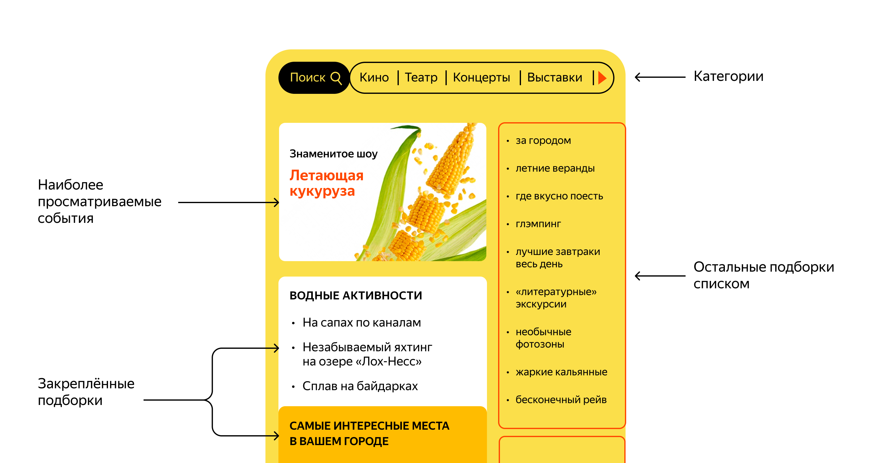

# Исследуй со мной

---

## Описание 

Приложение позволяет пользователям делиться информацией об интересных событиях и находить компанию для участия в них. 
Программа отвечает за формирование модели данных для следующей страницы:

## Функционал

### Два сервиса:
- основной сервис ewm-main содержит все необходимое для работы продукта
- сервис статистики ewm-stats хранит количество просмотров и позволяет делать выборки для анализа работы приложения

### API основного сервиса разделено на три части:
- публичная - доступна без регистрации любому пользователю сети
- закрытая - доступна только авторизованным пользователям
- административная - для администраторов сервиса

### Публичный API
- публичный API предоставляет возможности поиска и фильтрации событий
- сортировка списка событий организована по количеству просмотров, которое запрашивается в сервисе статистики
- просмотр списка событий возвращает краткую информация о мероприятиях
- просмотр подробной информации о конкретном событии
- каждое событие относится к закрепленным категориям
- получение всех категорий и подборок событий (подборки составляют администраторы ресурса)
- публичный запрос для получения списка событий или полной информации о мероприятии фиксируется сервисом статистики

### Закрытый API
- авторизованные пользователи имеют возможность добавлять в приложение новые мероприятия, редактировать их 
и просматривать
- настроена подача заявок на участие в интересующих мероприятиях
- создатель мероприятия имеет возможность подтверждать заявки, которые отправили другие пользователи сервиса
- авторизованные пользователи имеют возможность добавлять, редактировать, просматривать и удалять комментарии к событиям

### Административный API
- добавление, изменение и удаление категорий для событий
- добавление, удаление и закрепление на главной странице подборок мероприятий
- управление модерацией событий, размещенных пользователями, — публикация или отклонение
- управление пользователями — добавление, активация, просмотр и удаление
- управление комментариями — редактирование, просмотр и удаление

### Сервис статистики
- сбор информации о количестве обращений пользователей к спискам событий
- сбор информации о количестве запросов к подробной информации о событии

[Документация основого сервиса](https://github.com/heydancer/java-explore-with-me/blob/main/ewm-main-service-spec.json)

[Документация сервиса статистики](https://github.com/heydancer/java-explore-with-me/blob/main/ewm-stats-service-spec.json)

## Стек:
- Java 11
- Spring Boot
- Hibernate
- Maven
- Lombok
- Docker
- PostgreSQL
- Postman
- Swagger

[Ссылка на итоговый пул реквест](https://github.com/heydancer/java-explore-with-me/pull/5)
